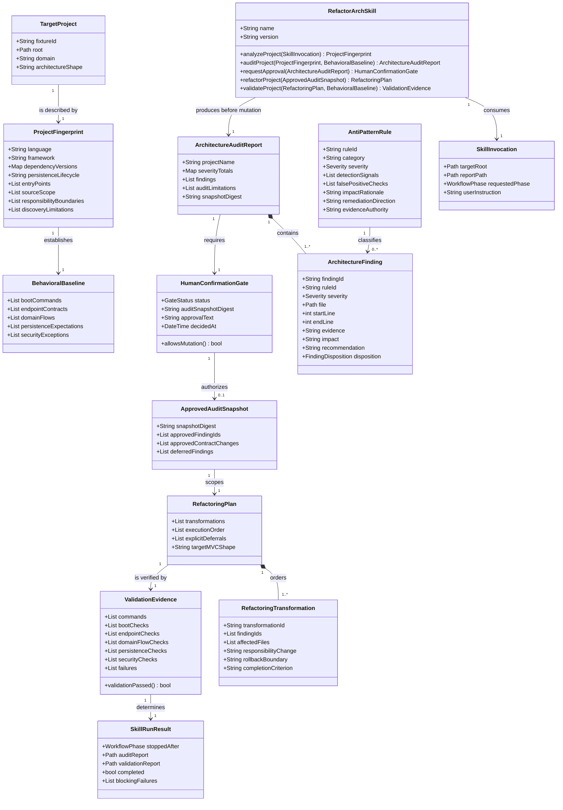

# Build and Calibrate the `refactor-arch` Architecture Skill

## Requirements

- Build a reusable Custom Skill named `refactor-arch` that understands an unfamiliar backend before auditing it, produces evidence-backed architecture findings, pauses for explicit human approval, and then performs contextual MVC refactoring with behavioral validation.
- Keep the orchestration technology-neutral while proving portability on `code-smells-project` (Flask/SQLite), `ecommerce-api-legacy` (Express/SQLite), and `task-manager-api` (Flask-SQLAlchemy/SQLite).
- Preserve each application's externally observable domain behavior, endpoint surface, status semantics, response meaning, and persistence effects except where the reviewed audit explicitly authorizes a security-driven contract change.
- Treat architecture as responsibility and dependency boundaries rather than a fixed directory template: retain useful existing structure, especially the Task Manager's models, blueprints, service, and helpers, and introduce only changes required to resolve confirmed findings.
- Calibrate the skill against a human-reviewed baseline of at least five genuine findings per fixture, with at least one CRITICAL or HIGH, two MEDIUM, and two LOW findings, without hardcoding those findings as the skill's answer key.
- Deliver equivalent repository-local skill copies, three ordered audit reports, post-refactor validation evidence, and complete README documentation for construction, execution, findings, results, and reproduction.

## Entities

The entities below are logical records exchanged by the skill and represented in Markdown. Do not create runtime wrapper classes for them unless a concrete implementation step cannot remain clear and verifiable without one.



## Approach

1. **Invariant workflow with progressive disclosure**:
   - Keep `SKILL.md` focused on input validation, phase state, mandatory outputs, the human gate, and routing to references; keep it below 500 lines and use imperative instructions with rationale.
   - Place detailed discovery heuristics, audit policy, report schema, MVC guidance, transformations, and validation procedures in focused Markdown references that are loaded only for the active phase.
   - Use the current repository convention `.agents/skills/refactor-arch/`; maintain the canonical package under `code-smells-project` and distribute verified equivalent copies to the other two fixtures.

2. **Context-first analysis and behavioral baselining**:
   - Inventory manifests, lockfiles, declared and installed dependency versions, entry points, route registration, persistence lifecycle, domain concepts, existing layers, generated/vendor exclusions, and realistic source scope before evaluating quality.
   - Discover the complete endpoint surface statically and reconcile it with README/request examples and, when safe, runtime route inspection.
   - Record boot commands, representative success and failure cases, multi-step domain flows, and state expectations before mutation so post-change validation compares behavior rather than only syntax.
   - If stack, scope, or endpoint discovery is uncertain, state the limitation and stop before refactoring rather than guessing.

3. **Evidence-based architecture audit**:
   - Evaluate only scoped source against a catalog spanning MVC/SOLID boundaries, security, validation, data integrity, performance, maintainability, and deprecated APIs.
   - Require every finding to include a stable identifier, one-based inclusive file and line range, concise evidence, impact, severity rationale, and a context-sensitive recommendation.
   - Sort findings CRITICAL → HIGH → MEDIUM → LOW; merge overlapping symptoms that share one root cause and cross-reference secondary rules instead of inflating counts.
   - Resolve deprecation against the detected version and authoritative current documentation. Follow repository documentation-fetch rules; in this workspace use the `ctx7` library-resolution command before fetching docs and report quota/network limitations instead of substituting an unverified claim.

4. **Immutable approval boundary**:
   - Treat Project Analysis and Architecture Audit as read-only with respect to target application source, configuration, schemas, and dependencies. Writing the required audit artifact under root `reports/` is allowed.
   - Compute a digest of the reviewed report or otherwise record an immutable snapshot identifier, show the proposed scope and any security-driven contract changes, and stop the run.
   - Accept only explicit approval that identifies the reviewed report. A general request to audit, silence, or the existence of a report does not authorize refactoring.
   - Surface newly discovered issues after approval as a scope change requiring a new disposition; do not silently expand mutation authority.

5. **Contextual MVC refactoring and centralized errors**:
   - Move transport parsing and response mapping to Flask blueprints/routes or Express routers, application-flow orchestration to controllers/services, domain and persistence responsibilities to models/repositories, environment values to configuration, and composition to an application factory or clear entry point.
   - Use a framework-idiomatic global exception handler equivalent: Flask registered error handlers and Express terminal error middleware map typed domain/application errors to sanitized JSON responses.
   - Decompose the E-commerce Flask controller/model/database chain and the LMS `AppManager` only as required; correct responsibilities inside the Task Manager's existing layered structure instead of rebuilding it.
   - Apply approved transformations in small dependency-ordered batches, preserving compatibility at module and HTTP boundaries where feasible and verifying behavior after each batch.

6. **Failure-sensitive validation and skill calibration**:
   - Validate dependency installation, database initialization/seed behavior, boot, every discovered endpoint, representative domain flows, persistence effects, error responses, and removal of approved security risks.
   - Make any failed boot, endpoint, domain-flow, persistence, or mandatory security check block a completion claim.
   - Use a skill-creator evaluation loop outside the distributed package: three realistic fixture prompts, with-skill and no-skill baselines launched together, objective assertions, timing/token capture, generated review output, and iteration based on human feedback.
   - Use manual findings for calibration and false-negative analysis, not as strings or fixture-specific rules embedded in the reusable skill.

## Structure

### Contract Relationships

1. `RefactorArchSkill` owns the workflow state machine `PROJECT_ANALYSIS → ARCHITECTURE_AUDIT → WAITING_FOR_APPROVAL → REFACTORING → VALIDATION`.
2. `ProjectAnalysisContract` defines the required `ProjectFingerprint` and `BehavioralBaseline` fields; stack-aware heuristics implement this contract without changing its output semantics.
3. `AuditPolicy` consumes a fingerprint plus the `AntiPatternCatalog` and emits `ArchitectureFinding` records through the `AuditReportContract`.
4. `HumanConfirmationGate` is the only component allowed to create an `ApprovedAuditSnapshot`; mutation procedures require that snapshot as an input.
5. `TransformationStrategy` selects framework-appropriate changes from the playbook while preserving the responsibility-based `MVCTargetContract`.
6. `ValidationStrategy` selects boot, HTTP, domain-flow, and persistence checks from the detected project fingerprint and returns `ValidationEvidence`.
7. Typed `DomainError`, `ValidationError`, `AuthorizationError`, and `InfrastructureError` concepts extend a shared application-error contract in each refactored target; a framework-native global handler maps them to sanitized responses.

### Dependencies

1. `SKILL.md` reads only the phase-relevant references and never treats framework examples as universal directory requirements.
2. Project Analysis depends on repository reads, manifest/lockfile inspection, route discovery, and documented run instructions; it does not depend on audit conclusions.
3. Architecture Audit depends on Project Analysis, the behavioral baseline, catalog rules, severity policy, and authoritative version evidence for deprecations.
4. Refactoring depends on an explicitly approved, immutable audit snapshot, the MVC target, and playbook transformations.
5. Validation depends on the pre-change behavioral baseline and the completed transformation dispositions; it does not accept a refactoring report as proof by itself.
6. README results depend on saved audit and validation evidence from all three fixtures.

### Layered Architecture

1. **Skill Orchestration Layer**: validates invocation input, owns phase transitions, enforces the approval gate, and composes final run results.
2. **Knowledge Layer**: supplies discovery heuristics, anti-pattern policy, severity rules, report schema, target responsibilities, transformations, and validation procedures through Markdown references.
3. **Evidence Layer**: captures fingerprints, baselines, exact-line findings, immutable audit snapshots, dispositions, and command/runtime evidence.
4. **Transformation Layer**: applies the smallest approved framework-specific change that restores responsibility boundaries and eliminates the root cause.
5. **Validation Layer**: executes reproducible boot, endpoint, flow, persistence, security, and artifact-consistency checks.
6. **Documentation Layer**: retains manual baselines, decisions, reports, before/after results, validation checklists, and execution guidance.

### Repository Artifacts

```text
code-smells-project/.agents/skills/refactor-arch/   # canonical package
├── SKILL.md
├── references/
│   ├── project-analysis.md
│   ├── anti-pattern-catalog.md
│   ├── audit-report-contract.md
│   ├── mvc-target-guidelines.md
│   ├── refactoring-playbook.md
│   └── validation-playbook.md
└── scripts/
    ├── validate_audit_report.py
    └── verify_skill_distribution.py

ecommerce-api-legacy/.agents/skills/refactor-arch/  # equivalent copy
task-manager-api/.agents/skills/refactor-arch/      # equivalent copy
reports/
├── audit-project-1.md
├── audit-project-2.md
├── audit-project-3.md
├── validation-project-1.md
├── validation-project-2.md
└── validation-project-3.md
refactor-arch-workspace/                            # local eval/review artifacts
README.md                                           # manual baselines and final evidence
```

## Operations

Execute tasks in order. Tasks 1–9 create and calibrate the reusable skill without changing target application behavior. Task 10 performs only read-only analysis and audit. Task 11 is separately gated for each fixture and must not begin for a project until its audit is explicitly approved.

### 1. Establish Manual Audit Baselines and Behavioral Contracts

1. **Responsibility**: Document the human-reviewed calibration truth and the pre-change behavior for all three fixtures.
2. **Inputs**: current source, READMEs, manifests/lockfiles, route declarations, database lifecycle, and request examples.
3. **Procedure**:
   - Record at least five exact-line findings per fixture in the root README: at least one CRITICAL or HIGH, two MEDIUM, and two LOW.
   - Cover genuine root causes already visible in each shape: Flask store secrets/debug/admin SQL and mixed controller/model/persistence concerns; LMS hardcoded credentials/card logging/weak hashing, `AppManager` concentration, callback/N+1/data-integrity problems; Task Manager weak password handling and serialization, route-owned orchestration/persistence, reporting query behavior, and duplicated or unused utility patterns.
   - For each finding include severity, file and one-based line range, evidence, impact, and expected remediation direction.
   - Inventory every route and capture representative request, expected status/response semantics, and state changes. Include Produto–Usuário–Pedido ordering, Course–Enrollment–Payment checkout/report/deletion, and Task–User–Category CRUD/report/login flows.
   - Distinguish persistent `loja.db`, in-memory LMS state recreated at boot, and Task Manager `tasks.db` seeded by `seed.py`.
4. **Completion Criteria**: all three baselines meet the severity distribution; all routes have a testable contract or an explicit documented discovery limitation; no target source is modified.

### 2. Create the Canonical Skill Orchestrator — `SKILL.md`

1. **Responsibility**: Define a reusable, concise three-phase workflow and hard approval state machine.
2. **Frontmatter**:
   - `name: refactor-arch`
   - A pushy description that triggers for architecture audits, legacy backend refactoring toward MVC, responsibility/SOLID reviews, code-smell audits requiring exact evidence, and gated behavior-preserving modernization across backend stacks.
3. **Invocation Contract**:
   - `target_root: Path` defaults to the current project root.
   - `report_path: Path` must be supplied or confirmed before Phase 2 is finalized.
   - `requested_phase` defaults to analysis and audit; Refactoring is unavailable until the gate records explicit approval.
4. **Core Procedures**:
   - `analyze_project(target_root: Path) -> ProjectFingerprint` discovers stack, domain, scope, entry points, dependencies, persistence, routes, and architecture.
   - `capture_behavioral_baseline(fingerprint: ProjectFingerprint) -> BehavioralBaseline` records boot, endpoints, flows, state, and limitations without mutation.
   - `audit_project(fingerprint: ProjectFingerprint, baseline: BehavioralBaseline, report_path: Path) -> ArchitectureAuditReport` applies catalog rules, validates evidence, sorts findings, writes the report, and stops.
   - `request_refactor_confirmation(report: ArchitectureAuditReport) -> HumanConfirmationGate` displays totals, proposed scope, contract changes, and asks for explicit approval tied to the report.
   - `refactor_project(snapshot: ApprovedAuditSnapshot) -> RefactoringPlan` loads target guidance and applies only approved transformations.
   - `validate_project(plan: RefactoringPlan, baseline: BehavioralBaseline) -> ValidationEvidence` executes the complete post-change contract and blocks success on failures.
5. **Guard Logic**:
   - Reject missing/unreadable target roots or unresolved referenced files.
   - Permit report creation but prohibit target application writes before approval.
   - Do not infer approval from the invocation prompt.
   - Require a new confirmation if findings or contract changes expand after approval.
6. **Completion Criteria**: `SKILL.md` stays below 500 lines, has no fixture-specific answer key, references every required knowledge file, and makes the stop-after-audit behavior unambiguous.

### 3. Implement Project Analysis Knowledge — `references/project-analysis.md`

1. **Responsibility**: Produce a bounded, reproducible project fingerprint before judgment.
2. **Discovery Logic**:
   - Identify language/framework from manifests, lockfiles, imports, and entry points; report declared and resolved versions separately.
   - Determine application domain from models/schema, routes, use-case verbs, seed data, and documentation.
   - Enumerate source scope using entry-point traversal and route/module imports; exclude dependencies, generated output, caches, databases, and vendored code while listing exclusions.
   - Identify architecture shape and current ownership of transport, orchestration, domain rules, persistence, configuration, error handling, and composition.
   - Discover routes from Flask decorators/blueprints/`add_url_rule` and Express router/application registrations, including indirect registration such as `AppManager.setupRoutes(app)`.
   - Capture database lifecycle, seed requirements, external integrations, boot command, ports, and environment dependencies.
3. **Unknown-Stack Behavior**: emit a partial fingerprint plus explicit limitations; do not force MVC transformations when source boundaries or runtime procedures cannot be established.
4. **Completion Criteria**: the same output schema correctly describes both Flask shapes and Express without assuming file names or directory layout.

### 4. Implement Audit Policy — `references/anti-pattern-catalog.md`

1. **Responsibility**: Define portable rules, severities, detection signals, false-positive checks, evidence requirements, and remediation directions.
2. **Minimum Catalog**: include at least twelve rules distributed across all severities, including:
   - CRITICAL: injectable/raw administrative data access, exposed production credentials/secrets, sensitive authentication/payment data exposure.
   - HIGH: God Class/God Method with unrelated reasons to change, weak credential storage/authentication, missing transaction/data-integrity boundary, route/controller ownership of domain and persistence responsibilities.
   - MEDIUM: N+1/query-in-loop behavior, missing boundary validation, duplicated transport/business logic, mutable process-global state, deprecated API with verified version evidence.
   - LOW: misleading names, magic values/strings, dead or unused code/imports, unnecessary branching/serialization duplication.
3. **Severity Logic**: preserve the repository definitions of CRITICAL, HIGH, MEDIUM, and LOW; severity follows actual impact and exploitability, not keyword presence.
4. **Evidence Logic**:
   - Require exact one-based inclusive source ranges.
   - Trace callers and ownership before claiming an architecture violation.
   - Ignore tests/examples/generated/vendor code unless they execute in the application path.
   - Require current version-matched authoritative evidence for deprecation; when unavailable, record an audit limitation rather than a finding.
   - Consolidate overlapping rules by root cause and cross-reference secondary impacts.
5. **Completion Criteria**: at least eight required distributed-severity rules exist, twelve are targeted, every rule has false-positive controls, and none names a fixture-specific file as its only detection condition.

### 5. Implement the Report Contract and Deterministic Validator

1. **Components**: `references/audit-report-contract.md` and `scripts/validate_audit_report.py`.
2. **Report Sections**:
   - Title and target identity.
   - Project Fingerprint and source-scope/exclusion table.
   - Behavioral Baseline summary and audit limitations.
   - Severity summary exactly in CRITICAL, HIGH, MEDIUM, LOW order.
   - Findings ordered by severity, each with ID, rule, location, evidence, impact, recommendation, and status.
   - Refactoring scope proposal, security-driven contract changes, and explicit approval prompt.
   - Audit snapshot digest.
3. **Validator Interface**:
   - `validate_report(report_path: Path, project_root: Path, minimum_findings: int = 5) -> ValidationResult`.
   - Verify required sections, severity order, summary/detail counts, unique IDs, path containment, existing files, valid inclusive line ranges, non-empty evidence/impact/recommendation, at least five findings, and at least one CRITICAL or HIGH.
   - Return non-zero on structural or evidence errors and print actionable diagnostics without rewriting the report.
4. **Completion Criteria**: the validator accepts all three compliant reports and rejects missing evidence, incorrect ordering, count mismatches, fabricated paths/ranges, or threshold failures.

### 6. Implement the Responsibility Target and Transformation Playbook

1. **Components**: `references/mvc-target-guidelines.md` and `references/refactoring-playbook.md`.
2. **MVC Responsibilities**:
   - Routes/views own HTTP concerns only: path, method, parsing, authentication context, controller call, response serialization.
   - Controllers/application services own use-case orchestration and transaction coordination.
   - Domain models/services own invariants and domain behavior without importing Flask or Express objects.
   - Repositories/data access own query construction and persistence details.
   - Configuration reads environment values and fails safely for missing required secrets.
   - Composition roots create dependencies, register routes/error handlers, and start the application.
3. **Global Error Strategy**:
   - Define typed application errors with stable `errorCode`, safe `message`, HTTP status mapping, and optional internal cause.
   - Register Flask global error handlers or Express terminal error middleware; validation, business, authorization, not-found, and infrastructure failures use one sanitized response schema.
   - Log internal diagnostics with correlation context while excluding passwords, tokens, raw card values, connection strings, and stack traces from client responses.
4. **Minimum Transformation Patterns**: provide at least ten concrete before/after patterns, including route-to-controller extraction, controller-to-service extraction, query-to-repository extraction, AppManager decomposition, application factory/composition root, environment configuration, centralized error handling, validation boundary, transaction-scoped multi-write flow, N+1-to-join/batch loading, secure password hashing, sensitive serialization filtering, and safe dependent-record deletion.
5. **Conservative Selection Rules**:
   - Preserve existing modules that already own one coherent responsibility.
   - Prefer extraction and dependency inversion over whole-project rewrites.
   - Do not create interfaces, repositories, DTOs, or entity wrappers when an existing simple type and direct boundary remain clear and testable.
   - Preserve public imports and endpoints through adapters during incremental moves when doing so reduces risk.
6. **Completion Criteria**: guidance expresses one responsibility model through idiomatic Flask and Express examples and includes at least eight executable before/after transformations without mandating one directory tree.

### 7. Implement Validation Knowledge — `references/validation-playbook.md`

1. **Responsibility**: Convert the pre-change behavioral baseline into failure-sensitive post-change evidence.
2. **Procedure**:
   - Install dependencies using the fixture's existing manifest and lockfile policy without unrequested upgrades.
   - Prepare isolated database state: preserve/back up the Flask store database, recreate LMS in-memory state per process, and initialize/seed a disposable Task Manager database.
   - Start each application on a non-conflicting local port, capture startup logs, wait for readiness with a bounded timeout, and stop the process reliably.
   - Exercise every endpoint with valid, invalid, not-found, and authorization-relevant cases as applicable.
   - Exercise ordering totals/inventory/status, checkout payment/enrollment/audit/report behavior, and task/user/category CRUD, search, statistics, reporting, login, and notifications or their controlled substitute.
   - Verify persistence effects, transaction rollback on partial failure, orphan prevention, secret externalization, password non-disclosure, safe credential hashing, card redaction, and sanitized errors.
   - Compare status and response semantics to the baseline; document approved security-driven differences separately.
3. **Evidence Format**: command, fixture state, request/input, expected result, actual result, pass/fail, relevant output excerpt, and artifact path.
4. **Completion Criteria**: no boot/endpoint/domain/persistence/mandatory-security failures remain; unavailable external integrations are replaced by an explicit deterministic test double or reported as blocking, never silently skipped.

### 8. Implement Skill Distribution and Equivalence Verification

1. **Components**: two copied skill directories and `scripts/verify_skill_distribution.py` in the canonical package.
2. **Interface**:
   - `verify_distribution(canonical: Path, copies: list[Path]) -> DistributionResult`.
   - Compare the relative file set and SHA-256 content digest for every distributed file, excluding only runtime caches explicitly listed by the script.
   - Return non-zero with the first differing/missing/extra path and expected/actual digest.
3. **Procedure**:
   - Complete and validate the canonical package first.
   - Copy the entire `refactor-arch` directory to `ecommerce-api-legacy/.agents/skills/` and `task-manager-api/.agents/skills/`.
   - Run the equivalence verifier after every canonical change and before each acceptance run.
4. **Completion Criteria**: all three packages expose the same `SKILL.md`, references, scripts, and behavior; no fixture-specific instruction is introduced into a copy.

### 9. Calibrate with the Skill-Creator Evaluation Loop

1. **Responsibility**: Demonstrate that the skill improves audit quality and respects the mutation gate without overfitting the fixtures.
2. **Eval Set**: create three realistic prompts, one per fixture, that request a complete audit and potential refactoring while supplying the target root and required report path.
3. **Assertions**:
   - Correct stack, domain, source scope, entry point, and architecture shape.
   - Required report structure, severity ordering, exact evidence, minimum finding count, root-cause deduplication, and at least one CRITICAL/HIGH.
   - No target source/config/dependency mutation before approval.
   - Correct use of version evidence for any deprecated-API claim.
   - Contextual MVC proposal that preserves useful structure and names behavioral validation obligations.
4. **Execution**:
   - Save the prompts and expected outcomes to `refactor-arch-workspace/evals/evals.json`; store run artifacts under `refactor-arch-workspace/iteration-N/` rather than inside the distributed package.
   - Give every with-skill and no-skill run its own disposable fixture copy or isolated worktree. Never point an evaluation agent at a canonical fixture, because a baseline without the gate may mutate files.
   - Launch with-skill and no-skill runs together for each eval; save outputs, timing, tokens, and assertion grades.
   - Generate the standard skill-creator review viewer and benchmark, obtain human feedback, inspect non-discriminating assertions and variance, then revise the canonical skill.
   - Repeat until human feedback is empty/satisfied or further changes do not create meaningful general improvement; redistribute and reverify after each revision.
5. **Completion Criteria**: the chosen skill version passes all safety-gate assertions, detects the meaningful manual baseline without embedding it, and has reviewed qualitative output for all fixtures.

### 10. Run Project Analysis and Architecture Audit on All Fixtures

1. **Responsibility**: Produce the three required review artifacts without changing target applications.
2. **Runs**:
   - Project 1: target `code-smells-project`, report `reports/audit-project-1.md`.
   - Project 2: target `ecommerce-api-legacy`, report `reports/audit-project-2.md`.
   - Project 3: target `task-manager-api`, report `reports/audit-project-3.md`.
3. **Per-Run Logic**:
   - Generate and display the fingerprint and behavioral baseline.
   - Generate the report, execute `validate_audit_report.py`, and correct only report-generation defects.
   - Compare detections with the human baseline to identify false negatives, false positives, duplicate root causes, and severity drift.
   - Stop at `WAITING_FOR_APPROVAL`, show proposed transformations and contract changes, and request explicit approval for that report.
4. **Completion Criteria**: all reports validate, contain at least five genuine findings and one CRITICAL/HIGH, and `git diff` confirms no target application source/config/dependency changes occurred during Phases 1–2.

### 11. Refactor and Validate Each Explicitly Approved Fixture

1. **Precondition**: a fixture-specific `HumanConfirmationGate` is approved and matches the current audit snapshot digest. Approval for one fixture does not authorize another.
2. **Core Logic**:
   - Convert approved findings into dependency-ordered transformations; give each finding a `resolved` or explicitly approved `deferred` disposition with rationale and residual risk.
   - Capture a targeted failing regression check before each behavior-affecting fix when practical, then make the smallest coherent change and rerun the relevant checks.
   - Establish or improve transport, controller/service, model/domain, repository/data, configuration, global error, and composition boundaries without mechanically normalizing the three trees.
   - Remove or control confirmed security issues rather than relocating them. Obtain additional approval before intentionally changing an unsafe public contract.
   - Run the complete validation playbook and save `reports/validation-project-{1,2,3}.md`.
3. **Project-Specific Focus**:
   - Flask store: preserve product/user/order/report flows and persistent data while removing unsafe admin behavior, hardcoded runtime configuration, and mixed transport/orchestration/persistence responsibilities.
   - Express LMS: preserve checkout/report/deletion semantics where safe while decomposing `AppManager`, protecting payment/credential data, enforcing transaction and referential integrity, and removing query-in-loop behavior.
   - Task Manager: retain useful models/blueprints/service/helpers, extract route-owned use cases and reporting persistence, secure authentication/serialization, centralize errors, and preserve task/user/category behavior.
4. **Transaction Management**: order creation and LMS checkout use explicit atomic boundaries; destructive user/category operations define cascade, restrict, or reassignment behavior and verify it.
5. **Completion Criteria**: each approved application boots, every inventoried endpoint and domain flow passes, persistence expectations hold, mandatory security checks pass, and no acceptance-blocking finding remains unresolved.

### 12. Finalize README and Acceptance Evidence

1. **Responsibility**: Make the repository self-explanatory and reproducible.
2. **README Content**:
   - Manual Analysis for all three projects with severity-distributed exact-line findings.
   - Skill Construction decisions, catalog rationale, technology-agnostic design, approval-gate behavior, and iteration notes.
   - Per-project audit totals, approved dispositions, before/after architecture, security changes, and validation checklists.
   - Runtime evidence for boot, endpoint and domain-flow checks, persistence, and remaining limitations.
   - Prerequisites and exact Codex skill invocation, audit, approval, refactoring, validation, and equivalence-verification commands.
3. **Final Checks**:
   - Run report validation for all three audit reports.
   - Run skill-copy equivalence verification.
   - Re-run each fixture's complete validation from a clean documented state.
   - Check repository status for unexpected generated databases, logs, caches, secrets, or unrelated changes.
4. **Completion Criteria**: all twelve acceptance criteria are mapped to concrete evidence paths in the README, and a fresh operator can reproduce the three workflows without hidden knowledge.

## Norms

1. **Skill Authoring**: use imperative instructions, explain why gates and checks exist, keep `SKILL.md` orchestration-focused, and use progressive disclosure through focused Markdown references.
2. **Naming**: use `refactor-arch` exactly; use stable kebab-case rule/finding/transformation IDs and the fixed report names `audit-project-1.md` through `audit-project-3.md`.
3. **Evidence**: use repository-relative POSIX paths and one-based inclusive line ranges; quote only the minimum source needed to identify the issue and keep impact separate from recommendation.
4. **Dependency Direction**: routes depend on controller/service contracts, application services depend on domain/repository abstractions, and infrastructure implements outward-facing boundaries; domain code must not import Flask or Express request/response objects.
5. **Dependency Injection**: prefer constructor or factory injection at the composition root; avoid service locators, module-global mutable dependencies, and interfaces that have only speculative value.
6. **Error Handling**: use typed errors with stable codes and safe messages; central handlers own HTTP mapping; unexpected errors are logged internally and returned as a generic response without secrets or stack traces.
7. **Validation**: validate and normalize untrusted data at the transport/application boundary, enforce domain invariants in domain code, and use database constraints as a final integrity layer.
8. **Transactions**: define transaction ownership at the application-service boundary for multi-write business flows and verify rollback behavior.
9. **Security**: load secrets from environment/configuration, use maintained password-hashing primitives, redact sensitive values, apply least privilege, and prohibit arbitrary SQL execution through HTTP.
10. **Logging**: use structured, severity-appropriate logs with correlation context; never log passwords, hashes, tokens, full payment-card values, connection strings, or personal data not needed for diagnosis.
11. **Documentation Sources**: version-sensitive claims cite authoritative current documentation and detected dependency versions. In this repository, use the required `ctx7` library-then-docs workflow and expose quota/network gaps.
12. **Testing**: favor observable integration and domain-flow checks over syntax-only checks; keep test state isolated and commands reproducible.
13. **Conservative Design**: reuse existing models, blueprints, simple data types, and framework conventions when they meet the responsibility contract; add abstractions only to remove demonstrated coupling or enable required testing.
14. **Documentation**: keep reports and README factual, link conclusions to saved evidence, distinguish baseline from post-change results, and never claim success when a required check was skipped or failed.

## Safeguards

1. **Functional Constraints**: enforce the exact phase order `Project Analysis → Architecture Audit → explicit approval → Refactoring → Validation`; all three fixtures must satisfy the complete workflow and required domain flows.
2. **Mutation Constraints**: before a matching explicit approval, do not edit target application source, configuration, manifests, lockfiles, schemas, databases, or tests. The audit report is the only permitted phase output write.
3. **Audit Constraints**: every project report contains at least five genuine, root-cause-distinct findings, including at least one CRITICAL or HIGH, and all findings have exact valid evidence, impact, and recommendation in descending severity order.
4. **Performance Constraints**: remove confirmed query-in-loop/N+1 behavior; under the same isolated local conditions, compare at least five runs of representative endpoints and treat a median latency regression greater than 20% as unresolved unless explained by an approved security/integrity correction.
5. **Security Constraints**: no hardcoded production-like secret, arbitrary SQL endpoint, raw credential/card logging, weak MD5/custom password hash, password serialization, or sensitive internal error output may remain in approved scope.
6. **Integration Constraints**: preserve documented ports or make them environment-configurable with the same defaults; unavailable payment/notification integrations require deterministic local substitutes and explicit evidence, not silent omission.
7. **Business Rule Constraints**: preserve order totals/inventory/status rules, successful-versus-denied checkout behavior and enrollment/payment consistency, and task status/priority/ownership/category/reporting semantics except for separately approved security corrections.
8. **Exception Handling Constraints**: typed business errors include stable codes and safe messages; all reach the framework's centralized global handler; internal causes and sensitive details never cross the HTTP boundary.
9. **Technical Constraints**: use no fixed universal directory tree, no fixture-specific audit answer key, no unverified deprecated-API claim, and no unrelated dependency upgrade or refactor.
10. **Data Constraints**: protect existing persistent SQLite state, use disposable copies for destructive validation, require atomic multi-write flows, and prevent orphaned enrollment/payment/order/task records according to explicit ownership rules.
11. **API Constraints**: preserve paths, methods, expected status classes, response meaning, and side effects. Any deliberate incompatibility must be listed in the approved audit snapshot and validated as the secure replacement.
12. **Completion Constraints**: a run is successful only when the application boots, every inventoried endpoint and representative domain flow passes, persistence and security checks pass, reports validate, skill copies match, and all approved findings have resolved or explicitly accepted dispositions.
